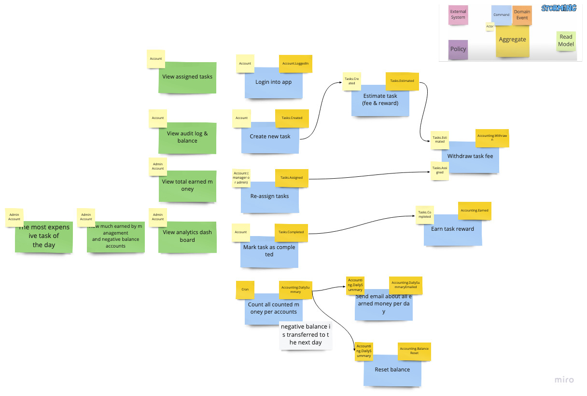

## Task Tracker

---

**Title:** Таск-трекер должен быть доступен всем сотрудникам

**Actor:** Account

**Command:** Login into app

**Data:** ???

**Event:** Account.LoggedIn

---

---

**Title:** Новые таски может создавать кто угодно

**Actor:** Account

**Command:** Create task

**Data:** Account, Task

**Event:** Tasks.Created

---

---

**Title:** Менеджеры или администраторы должны иметь кнопку “заассайнить задачи”, которая рандомно заайсайнит открытые задачи на случайных сотрудников (кроме менеджера или администратора)

**Actor:** Account (manger or admin roles)

**Command:** Re-assign tasks

**Data:** Account (non-manger or admin roles)

**Event:** Tasks.Assigned

---

---

**Title:** Каждый сотрудник может отметить задачу выполненной

**Actor:** Account

**Command:** Mark task as completed

**Data:** ???

**Event:** Tasks.Completed

---

## Accounting

---

**Title:** Аккаунтинг доступен для входа всем пользователям

**Actor:** Account

**Command:** Login into app

**Data:** Account

**Event:** Accounts.LoggedIn

---

---

**Title:** Withdraw on task assign

**Actor:** Tasks.Assigned

**Command:** Withdraw on task assign

**Data:** Account, Task

**Event:** Accounting.Withdraw

---

---

**Title:** Define task fee and reward

**Actor:** Tasks.Created

**Command:** Reward and fee calculated on task creation

**Data:** Task

**Event:** Accounting.Estimated

---

---

**Title:** Earn on task completion

**Actor:** Tasks.Completed

**Command:** Account earn on task completion

**Data:** Account, Task

**Event:** Accounting.Earn

---

---

**Title:** On EoD count earned money for accounts

**Actor:** end of day

**Command:** count earned money

**Data:** Account, Tasks

**Event:** Accounting.DailySummary

---

---

**Title:** Email earned amount

**Actor:** Accounting.DailySummary

**Command:** send email with amount earned per day

**Data:** ???

**Event:** Accounting.DailySummaryEmail

---
